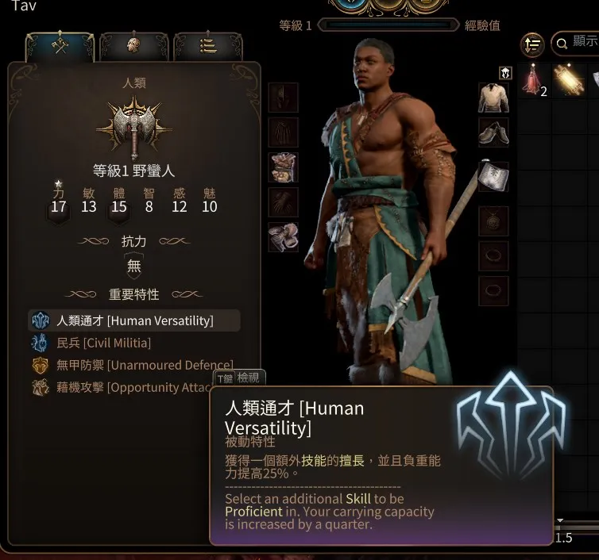

# BG3 Localization Merger

BG3 Localization Merger is a program designed to merge two languages together within Baldur's Gate 3, a video game.

[中文說明](docs/README.zh-TW.md)

## Features

### Merge Categories

This tool allows you to merge strings from various categories:

- Dialogues
- Books
- Items
- Status
- Characters
- Quests
- Tooltips
- Hints
- Miscs

### Merge Unconditionally

A cautionary option is available to merge **all** strings in the game. This can cause overflow in some user interfaces. Use with care.

## Installation

Follow these steps to install and use the tool:

1. Download the [latest release](/../../releases/latest).
2. Extract the downloaded files to a location of your choice.
3. Run `BG3LocalizationMerger.exe`.

## Usage

### 1. Unpack the Official Packages

_You can skip this step if you are merging unconditionally._

To proceed, follow these instructions:

- Install BG3 Modder's Multitool:
  - Download and run [BG3 Modder's Multitool](https://github.com/ShinyHobo/BG3-Modders-Multitool/releases).
  - Complete the basic configuration by clicking **Configuration** in the menu.
- Unpack the following packages by selecting **Utilities/Game File Operations/Unpack Game Files**:
  - `Game.pak`
  - `Gustav.pak`
  - `Shared.pak`
  - `Patch*.pak` (Optional)
- After unpacking, select **Utilities/Game File Operations/Decompress UnpackedData Files** and wait for the process to complete.
- Close the tool.
- The unpacked data can be found in `[BG3 Modder's Multitool Folder]/UnpackedData`.

### 2. Fill in the Fields in BG3 Localization Merger

Proceed with these steps to fill in the required information:

- **Unpacked Data Folder**: Provide the path to the `UnpackedData` folder from [step 1](#1-unpack-the-official-packages).
  - Skip this if you are merging unconditionally.
- **Language Pack**: Locate the localization pack file for your game language.
  - Find this file in `[BG3 Game Folder]/Data/Localization`.
  - Example: `[BG3 Game Folder]/Data/Localization/English.pak`.
- **Reference Language Pack**: Select the second language pack.
  - Example: `[BG3 Game Folder]/Data/Localization/ChineseTraditional/ChineseTraditional.pak`.
- **Export File Path**: Specify the location to save the merged language pack.
  - Use the same file name as the current language pack of the game and put it in a temporary folder.
  - Example: `D:\Temp\ChineseTraditional.pak`
- Toggle the categories you wish to merge.

### 3. Start Merging
- Click **Merge** and wait for the process to complete.
  - If you're merging unconditionally, click **Merge Everything** instead.

### 4. Replace the Language Pack File
- Replace the current language pack file of the game with the exported file. E.g. `[BG3 Game Folder]/Data/Localization/ChineseTraditional/ChineseTraditional.pak`

### 5. Launch the Game and Review the Results

That's it! If you encounter any issues or have any suggestions, please consider [checking for existing issues](/../../issues) or [opening a new issue](/../../issues/new).

## Updating

To ensure the language pack stays up-to-date, you might need to merge again:

- If it's a hotfix, you'll only need to unpack and decompress the newest hotfix file. E.g. `Patch5_Hotfix6.pak`

- If it's a major patch, you'll need to remove the `Patch*_Hotfix*` folders in your `UnpackedData` folder first to avoid conflicts, then redo [all the steps](#usage).

## Screenshots

### Dialogues

### Books

### Hints

### Items

### Quests

### Status
