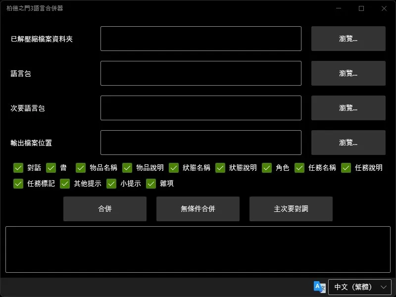
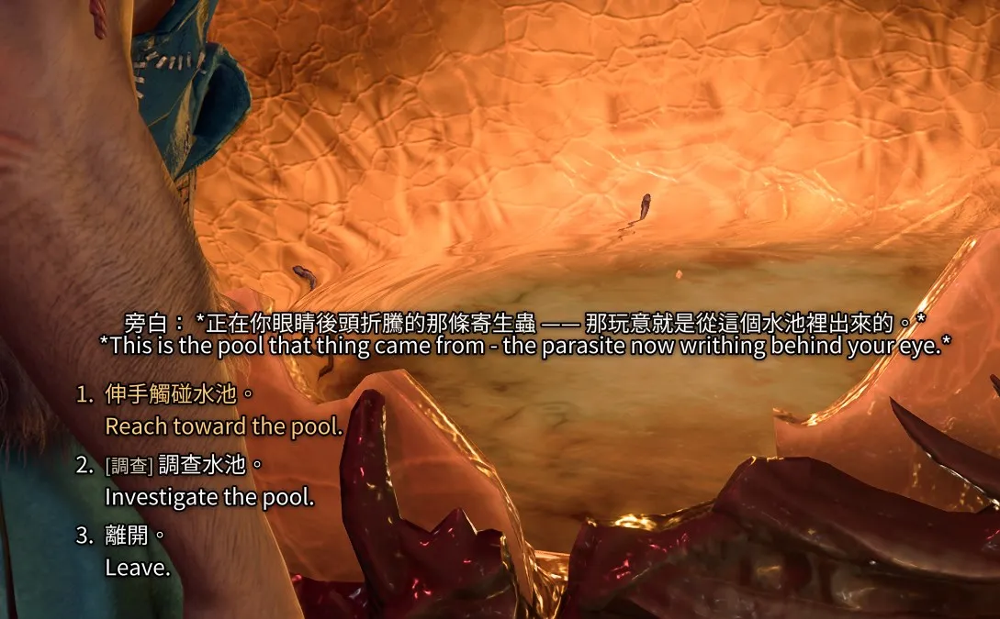
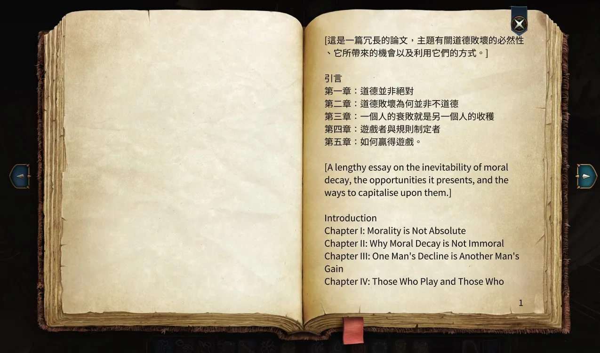
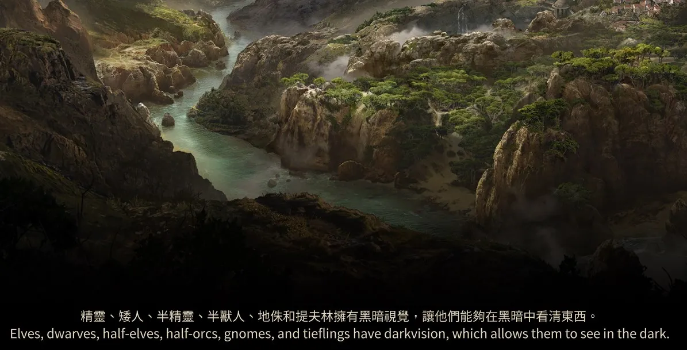
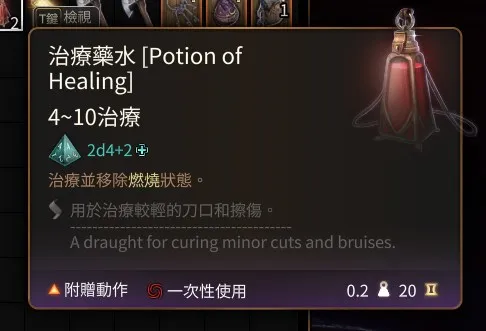
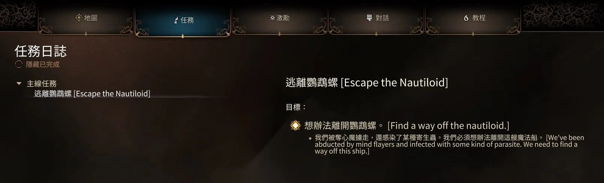
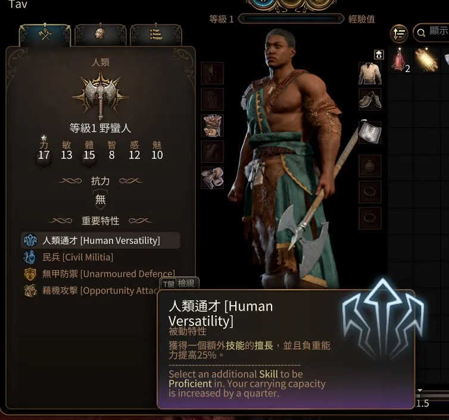

# 柏德之門3語言合併器

柏德之門3語言合併器是一個設計用於在《柏德之門 3》這款遊戲中將兩種語言合併在一起的程式。

## 功能特點

### 合併分類

這個工具允許您合併來自不同分類的字串：

- 對話
- 書
- 物品
- 狀態
- 角色
- 任務
- 小提示
- 其他提示
- 雜項

### 無條件合併

你也可以選擇將遊戲中的**所有**字串合併。這會導致文字在某些使用者界面中溢出。請謹慎使用。

## 安裝

按照以下步驟安裝並使用這個工具：

1. 下載[最新版本](/../../releases/latest)。
2. 將下載的文件解壓縮到您選擇的位置。
3. 執行 `BG3LocalizationMerger.exe`。

## 使用方法

### 1. 解壓縮官方套件

_如果您是無條件合併，可以跳過這一步。_

按照以下說明繼續：

- 安裝《BG3 Modder's Multitool》：
  - 下載並運行 [BG3 Modder's Multitool](https://github.com/ShinyHobo/BG3-Modders-Multitool/releases)。
  - 通過在右下角點擊 **星形圖示** 來完成基本配置。
  - 如果需要，首先下載 [LSLib](https://github.com/Norbyte/lslib/releases)。
  - 只需要輸入 LSLib 的 `divine.exe` 和遊戲的 `bg3.exe` 兩個欄位。
- 通過選擇 **解包.pak檔案 (Unpack .pak files)** 來解包以下套件：
  - `Game.pak`
  - `Gustab.pak`
  - `Shared.pak`
  - 此外，解包所有可用的更新檔案（`Patch*.pak`）。
- 解包後，點擊 **解壓文件 (Decompress Files)** 並等待處理完成。
- 關閉這個工具。
- 解包的數據可以在 `[BG3 Modder's Multitool 資料夾]/UnpackedData` 找到。

### 2. 完成柏德之門3語言合併器的設定

按照以下步驟填寫：

- **已解壓縮檔案資料夾**：提供從[步驟 1](#1-解壓縮官方套件)中的 `UnpackedData` 資料夾的路徑。
  - 如果您是無條件合併，請跳過這一步。
- **語言包**：找到遊戲語言的檔案。
  - 在 `[BG3 遊戲資料夾]/Data/Localization` 中找到這個檔案。
  - 例如：`[BG3 遊戲資料夾]/Data/Localization/ChineseTraditional/ChineseTraditional.pak`。
  - 註：如果您是使用第三方的語言包（例如巴哈修正版），請直接選第三方的語言包檔案即可。
- **次要語言包**：選擇第二個語言包。
  - 例如：`[BG3 遊戲資料夾]/Data/Localization/English.pak`。
- **輸出檔案路徑**：指定保存合併後語言包的位置。
  - 建議將其放在 `[BG3 遊戲資料夾]/Data` 目錄中，以確保它覆蓋原始語言包。
  - 例如：`[BG3 遊戲資料夾]/Data/MergedLocalization.pak`。
- 選擇你要合併的分類。

### 3. 開始合併
- 點擊 **合併** 並等待處理完成。
  - 如果您正在進行無條件合併，請改點擊 **無條件合併**。

### 4. 開始遊戲並檢視結果

就這樣！記得在遊戲更新時更新合併的語言包。

只需[解包並解壓縮](#1-解壓縮官方套件)最新的更新檔案（最近的 `Patch*.pak`），然後再次[合併](#3-開始合併)。

## 截圖

### 對話

### 書

### 小提示

### 物品

### 任務

### 狀態
